### 1.对垃圾分类规则**不同熟悉程度**的人对于使**用数字化工具**来改进垃圾分类行为的**看法**：

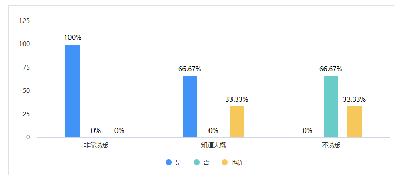

对垃圾分类规则非常熟悉的人非常愿意使用数字化工具来辅助他们进行垃圾分类，知道大概和完全不熟悉的人也有2/3的人愿意使用数字工具

### 2.居住不同类型住宅的人的垃圾分类频次：

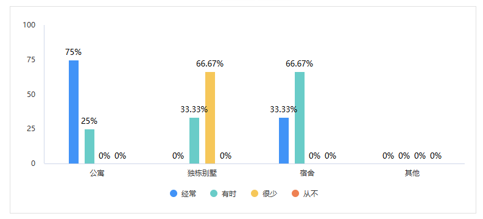

住在公寓和宿舍的人更乐意去进行垃圾分类，住在独栋别墅的人反而很少进行垃圾分类

### 3.同居人数对垃圾分类的频次影响：

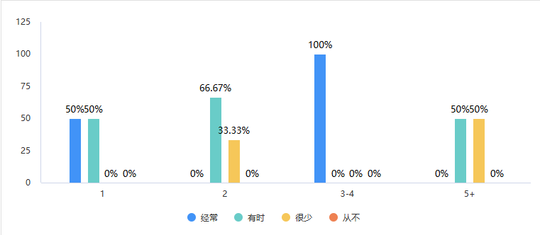

从本次问卷结果看，同居人数较少时(＜5人)更乐意去进行垃圾分类

### 4.认为正确的垃圾分类对环境保护的重要性程度与是否愿意使用数字化工具改进垃圾分类行为的关系：

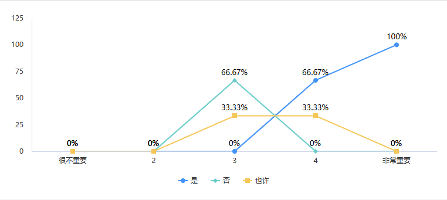

认为垃圾分类对环境保护很重要的人更乐意去使用数字化工具辅助垃圾分类

### 5.正确分类垃圾的必要性

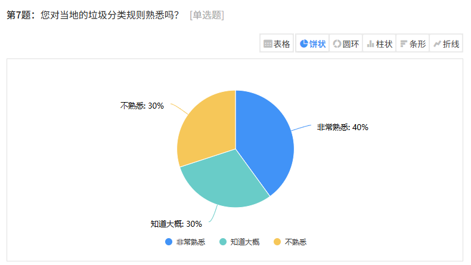

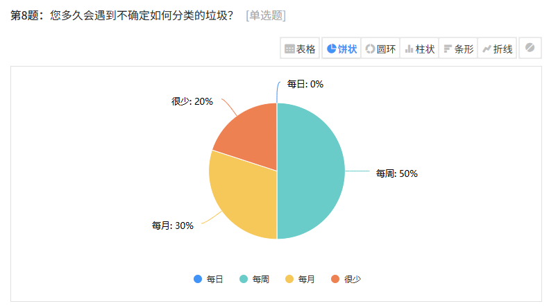

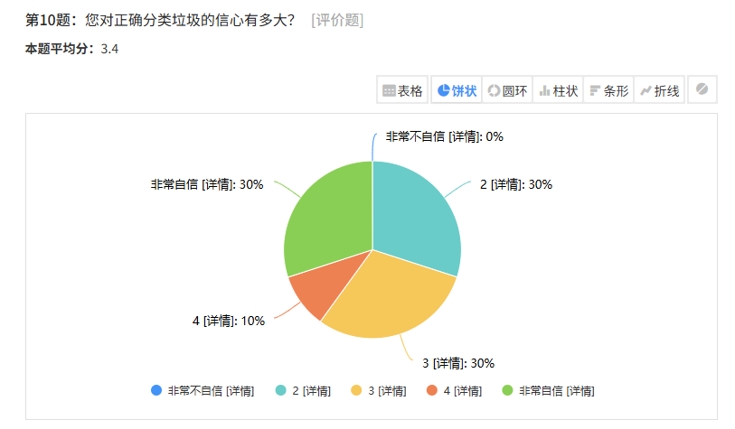

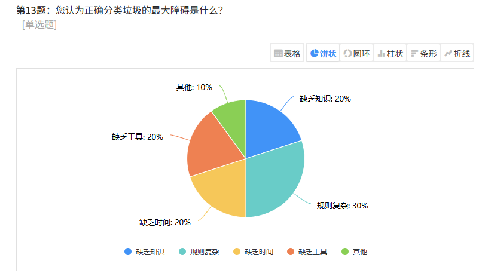

绝大多数受访者对垃圾分类的规则不熟悉，几乎每周都会遇到不知道怎么分类垃圾的情况，绝大多数人(60%)的人对自己分类的结果不自信，主要障碍是规则复杂、缺乏知识，其次是没有时间、缺乏辅助工具

### 6.是否愿意使用数字化工具来改进垃圾分类

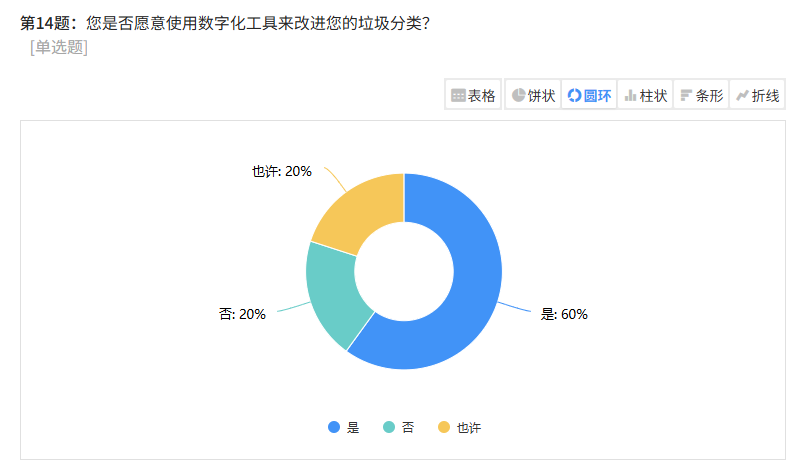

绝大多数受访者愿意使用数字化工具辅助垃圾分类

### 7.对垃圾分类app功能的期望：

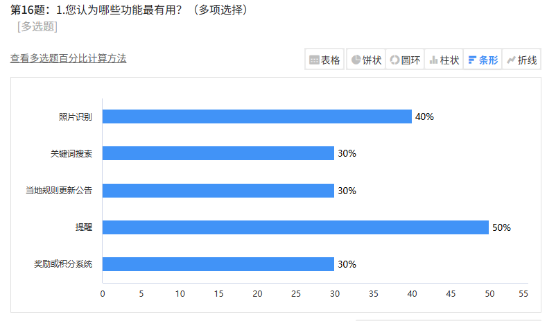

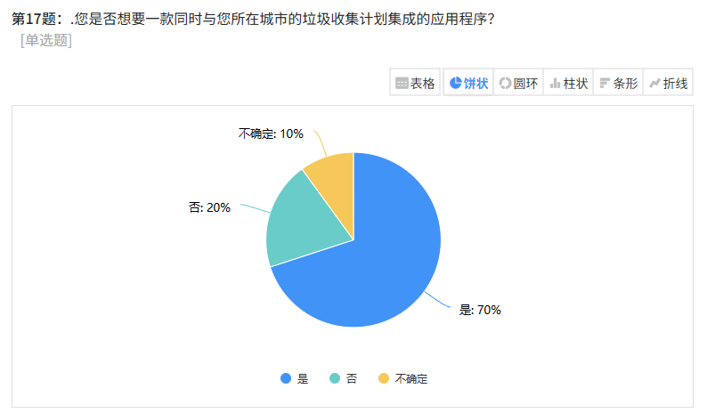

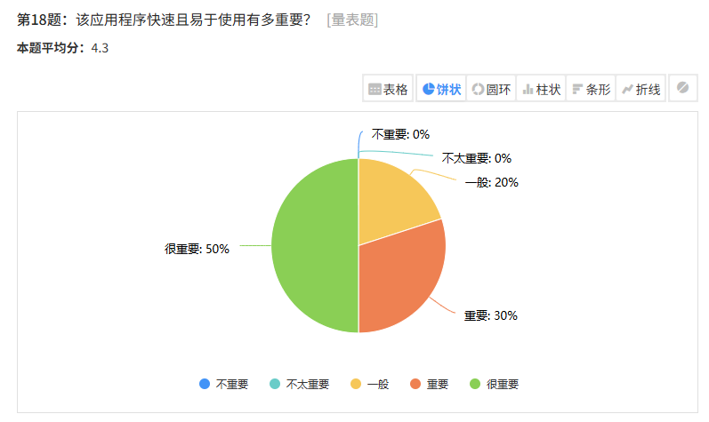

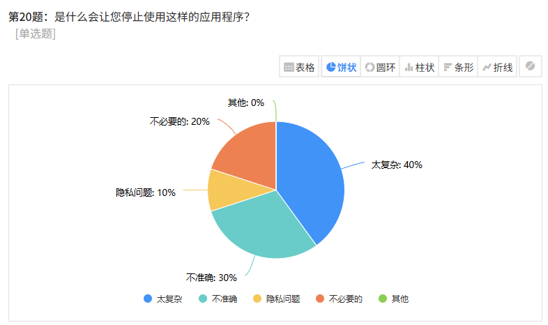

用户更希望设置图片识别和提醒功能，希望与所在城市垃圾分类制度相适应，希望垃圾分类程序能够快速且易于使用，并且功能简单，不能太复杂，识别和结果必须准确