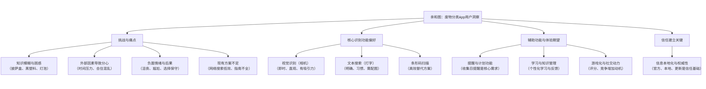

从原始记录中提取数据点，进行分组，创建主题，并最终形成数字版亲和图和总结。

***第一步：提取数据点（创建“便签海洋”）***

仔细阅读每一段采访，将每个有意义的观点、感受、行为或需求总结成一条简短的陈述，写在一张“便利贴”上。目标是生成30+个数据点。

**参与者 1: 郭婉悠 (28岁，城市公寓，追求正确但常困惑)**

1. S1: 尝试正确分类，但系统不完美
2. S2: 对明显物品（如瓶子、纸板）分类有信心
3. S3: 对“灰色地带”物品感到困惑（如披萨盒）
4. S4: 会手动分割处理复杂物品（如撕开披萨盒）
5. S5: 担心自己的错误会污染整个回收箱
6. S6: 对包装材料尤其不确定（如黑色塑料盒）
7. S7: 看到邻居的错误行为会导致自我怀疑
8. S8: 不确定时会先尝试网络搜索
9. S9: 认为网络搜索繁琐且结果矛盾
10. S10: 为省事，可能将不确定物品扔进普通垃圾箱
11. S11: 理想功能是相机即时识别
12. S12: 认为打字搜索不如视觉搜索直观
13. S13: 期望通过App学习以积累知识
14. S14: 需要垃圾收集日提醒功能

**参与者 2: 郑建国 (65岁，郊区住宅，严谨但寻求权威)**
 \15. D1: 遵循地方议会发放的指导手册
 \16. D2: 认为官方手册内容不全面（如灯泡处理）
 \17. D3: 会花时间在线研究疑难物品
 \18. D4: 在线信息矛盾时感到沮丧
 \19. D5: 最终为避免风险，将不确定物品归为普通垃圾
 \20. D6: 因规则不统一、复杂而感到沮丧
 \21. D7: 对App的权威性和本地化信息有极高要求
 \22. D8: 偏好打字搜索而非相机识别
 \23. D9: 希望结果附带清晰的图片和文字说明

**参与者 3: 李文静 (31岁，母亲，追求效率)**
 \24. C1: 时间紧迫是最大挑战
 \25. C2: 在混乱环境下进行快速决策
 \26. C3: 对明显可回收物进行回收
 \27. C4: 对脏污物品直接视为普通垃圾
 \28. C5: 对复杂物品（如儿童玩具）无暇处理，直接丢弃
 \29. C6: 曾因分类错误被纠正感到尴尬
 \30. C7: 核心需求是“速度”
 \31. C8: 提出“条形码扫描”作为理想解决方案
 \32. C9: 强烈需要收集日的推送提醒

**参与者 4: 谈闻宣 (22岁，学生，需要社交和动力)**
 \33. B1: 与室友共同处理，标准宽松
 \34. B2: 因规则不明，分类变成“随意为之”
 \35. B3: 垃圾箱满时，分类规则被忽视
 \36. B4: 常见困惑物品引发室友间争论
 \37. B5: 将App视为解决争论的权威工具
 \38. B6: 认为相机识别是“最酷、最快”的方式
 \39. B7: 希望App具有智能学习功能，提供反馈
 \40. B8: 提出“游戏化”（如家庭回收评分、邻里竞争）以保持动力

***第二步：分组与命名（寻找主题）***

现在，我们将这40个数据点进行分组，并为其创建上位标签（主题）。

***主题A：用户面临的挑战与痛点***

- **A1:** **知识模糊与困惑** (S3, S6, D2, B4) 

- - 对灰色地带、包装材料、特定物品（披萨盒、黑塑料、灯泡、肉盘）不确定。

- **A2:** **外部因素导致的分心与错误** (C1, C2, C5, B1, B3, B5) 

- - 时间压力、环境混乱、合住情况、垃圾箱已满。

- **A3:** **负面情绪与后果** (S5, S7, D4, D6, C6, D5, S10)     

- - 担心污染、自我怀疑、沮丧、尴尬、因困惑而选择“最安全”的错误做法。

- **A4:** **现有解决方案的不足** (S8, S9, D1, D3) 

- - 网络搜索低效、官方指南不全面、信息矛盾。

***主题B：对核心识别功能的偏好与需求***

- **B1:** **视觉识别（相机）派** (S11, S12, B6, B8) 

- - 认为其即时、直观、像魔术、有吸引力。

- **B2:** **文本搜索（打字）派** (D8, D9) 

- - 偏好明确、习惯性、希望结果附带参考图片。

- **B3:** **替代方案：条形码扫描** (C8) 

- - 被认为在购物场景中非常高效。

***主题C：对辅助功能与体验的期望***

- **C1:** **提醒与计划功能** (S14, C9) 

- - 收集日提醒是普遍且强烈的需求。

- **C2:** **学习与知识管理** (S13, B7) 

- - 希望通过App学习，并获得个性化反馈。

- **C3:** **游戏化与社交动力** (B8) 

- - 评分、竞争、社交证明可以增加长期使用动机。

***主题D：建立信任与权威的关键***

- **D1:** **信息的本地化与权威性** (D7, D9, B5) 

- - 必须来自官方、本地化、及时更新，这是信任的基础。

### 第三步：形成数字版亲和图

以下是根据以上分组形成的数字版亲和图的结构化展示，它清晰地显示了从数据点（叶子节点）到主题（父节点）的归纳过程。

### 第四步：总结分析与关键发现

根据上面的亲和图，我们可以撰写总结段落：

- **主要主题**：分析揭示了用户需求的四个核心维度：1) **面临的普遍挑战**，包括知识盲区、生活场景干扰以及由此产生的负面情绪；2) 对**核心识别功能**的不同偏好（相机、打字或扫码），这要求产品设计需兼顾不同用户习惯；3) 对**辅助功能**的强烈期望，如收集日提醒和学习教育功能；4) 建立**信任**的基石是信息的本地化与权威性。

- **类别关系**：信任（D）是用户采纳App的基石。在此基础上，App需要通过易用的核心功能（B）来解决用户的核心挑战（A）。而优秀的辅助功能与体验（C）（如提醒、游戏化）则是提升用户粘性和长期满意度的关键，形成完整的用户体验闭环。

- **意外发现**：

- 1. **用户分群鲜明**：对核心识别功能的偏好并非铁板一块，而是清晰地区分为“视觉派”（年轻、追求效率）和“文本派”（年长、追求严谨），这强烈暗示产品应提供并行入口。
  2. ******“条形码扫描”****** 作为一个独特的解决方案被提出，它结合了速度和准确性，是一个值得深入探索的功能点。
  3. **动机的多样性**：除了解决困惑的基本需求，用户还存在深层的社交和游戏化动机（如谈闻宣的想法），这为促进长期参与提供了创新方向。

 